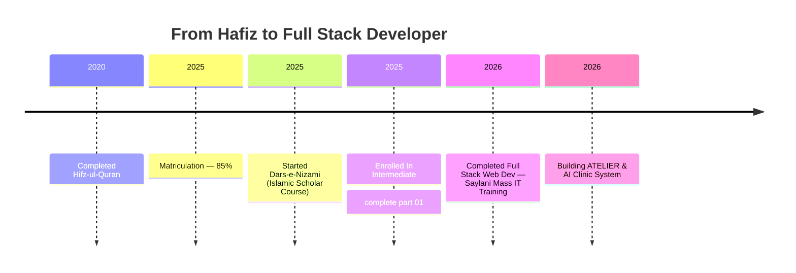

<table align="center" border="0" cellpadding="0" cellspacing="0">
  <tr>
    <!-- Aapki GitHub DP (Left Side) -->
    <td valign="center" align="center" style="padding-right: 15px;">
      
    </td>
    <!-- Aapka Waving Banner (Right Side) -->
    <td valign="center">
      
    </td>
  </tr>
</table>

  

---

  

### 💫 About Me:

- 🕌 **Hafiz-e-Quran** (2020) — memorized the entire Quran before I ever wrote a line of code
- 💻 Full Stack Web Development learner — trained at **Saylani Mass IT Training**
- ⚙️ Working with **React • Node.js • Express • MongoDB • TypeScript • Tailwind**
- 🚀 Building real-world apps — check out **ATELIER** (e-commerce) & **AI Clinic System**
- 🌱 16 years old, self-taught, and still learning every single day
- 📍 Based in Karachi, Pakistan

> 💡 **Fun fact:** I memorized the entire Quran before I wrote my first `console.log()` — discipline transfers.

---

### 🗣️ Languages I Speak

  
  

---

### 🛣️ My Journey

---

### 🎓 Certifications

  

---

### 🐍 My Contribution Snake

  

---

### 📈 Activity Graph

  

---

### 🚧 Currently Working On

- 🛒 **ATELIER** — Full-stack e-commerce platform (TypeScript)
- 🏥 **AI Clinic System** — Role-based auth + real-time updates
- 📱 Exploring React Native for mobile app development

---

### 📚 Currently Learning

  
  
  

---

### 🌐 Connect With Me:

  
  
  

---

### 💻 Tech Stack:

  
  
  
  
  
  
  
  
  
  
  
  
  

---

### 📊 GitHub Stats:

  
  

  

  

---

### ✨ Quote of the Day

  

---

<i>16 years old. Full stack developer. Just getting started. 🚀</i>

### 💬 Ask Me About

`React & Next.js` `Node/Express APIs` `MongoDB` `Freelancing as a beginner` `Balancing Deen + Dunya`

---

